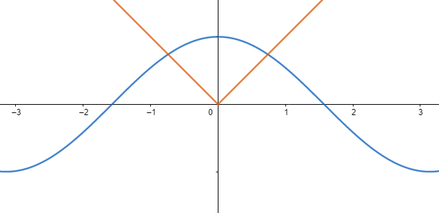
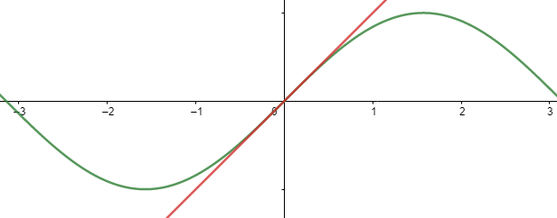
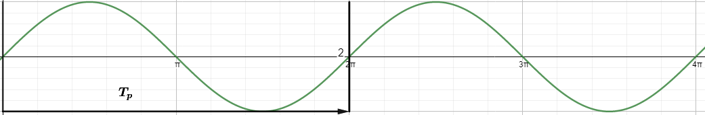
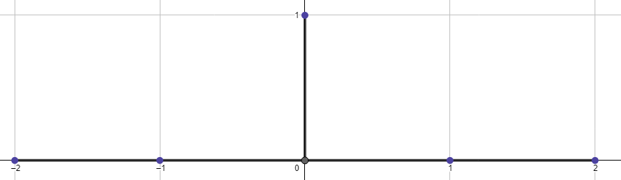
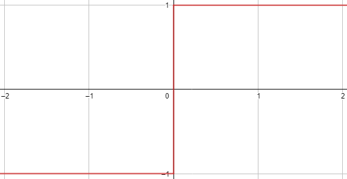
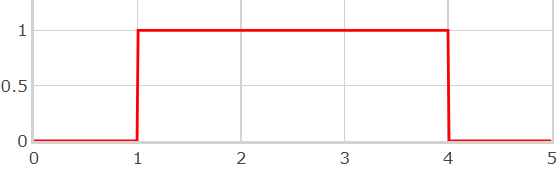
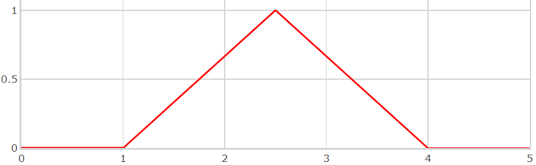
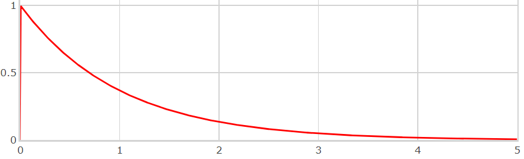
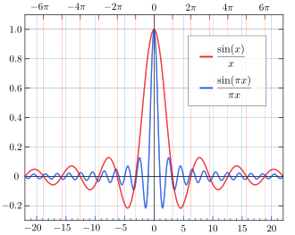

# Zusammenfassung

## Array Indizierung

### Bsp. Array Indizierung

1D
Von 0 Aufwährts
array[element]

Bsp.

```python
arr = np.array([1, 2, 3, 4])
print('2nd element: ',arr[0])

=>2nd element: 2
```

2D
Erst Zeile dann Spalte in Klammerschreibweise von außen nach innen
array2d[row,element]

```python
arr = np.array([[1,2,3,4,5], [6,7,8,9,10]])
print('5th element on 2nd row: ', arr[1, 4])

=>5th element on 2nd dim: 10
```

---

## Array Slicing

### Bsp. Array Slicing ohne Step

#### 1D

array[startpunkt:endpunkt]        Array von Startpunkt bis Endpunkt
array[:endpunkt]                  Array von Anfang bis Endpunkt
array[startpunkt:]                Array von Startpunkt bis Ende
array[:]                          ganzes Array
**Wichtig**
Das Ergebnis beinhaltet den Startindex, schließt aber den Endindex aus.
Minus-Operator wird genutzt um auf einen Index vom Ende her zu verweisen

```python
arr = np.array([1, 2, 3, 4, 5, 6, 7])
print(arr[4:])

=>[5 6 7]

arr = np.array([1, 2, 3, 4, 5, 6, 7])
print(arr[-3:-1])

=>[5 6]
```

#### 2D

array[startzeile:endzeile,startelement:endelement]

```python
arr = np.array([[1, 2, 3, 4, 5], [6, 7, 8, 9, 10]])
print(arr[1, 1:4])

=>[5 6]
```

### Bsp. Array Slicing mit Step

array[startpunkt:endpunkt:step]   Step ist die Schrittweite default = 1 jeder Wert
Bsp. 2 = jeder 2. Wert

```python
arr = np.array([1, 2, 3, 4, 5, 6, 7])
print(arr[1:5:2])

=>[2 4]
```

---

## Neuordnen von Matritzen mit "reshape"

### Bsp. Voyager erste Bilder

```python
kreis = channel1[start:start+500*1000]

bild = kreis.reshape(500,1000)

plt.imshow(bild)
plt.show()
```

Zuerst wird ein Stück mit der Länge 500*1000 herausgeslicet und dann in ein 2D Array mit der größe [500,1000] gespeichert dieses kann dann mit plt.imshow() als Bild angezeigt werden

## Signale und ihre Eigenschaften

### Signale

#### Zeitkontinuierlich

$x(t)$

#### Zeitdiskret

$x(k*Ts) = x[k]  Ts ... Samplingperiode$

### Elementare Operationen

#### zeitliche Verschiebung

$x(t − t0) ... Verzögerung um t0$

#### Spiegelung

$x(t0 − t) ... Zeitinversion$

#### zeitliche Skalierung

$x(a · t)$

### Komplexe Signale

#### kartesischer Darstellung

$x(t) = Re{x(t)} + Im{x(t)}$

#### polarische Darstellung

$x(t) = |x(t)| · ej∠(x(t))$

### Eigenschaften von Signalen

#### gerade

$x(t) = x(−t)$
    <p align="left">
        
    </p>

#### ungerade

$x(t) = −x(−t)$

<p align="left">
  
</p>

##### Jedes Signal lässt sich in einen geraden und ungeraden Anteil zerlegen

$x(t) = xg(t) + xu(t)$ <br>
$x_g(t) = \frac{1}{2}(x(t) + x(−t))$ <br>
$x_u(t) = \frac{1}{2}(x(t) − x(−t))$

#### periodische Signale

$x(t) = x(t + nT_p)$
Mit der Periodendauer Tp und ganzzahligem Vielfachem n
<p align="left">
  
</p>

### Ausgewählte Signale

#### zeitdiskreter Dirac-Impuls

$\delta[\text{k}] = \{1 \text{ für  k}  = 0; 0 \text{ für  k} \neq 0\}$
<p align="left">
  
</p>

##### Ausblendeigenschaft

Bei Multiplikation des (zeitverschobenen) Dirac mit einem
anderen Zeitsignal werden alle Werte des Zeitsignals bis auf den an der Stelle des
Dirac-Pulses ausgeblendet.

$x[k]\cdot \delta[k-k_0] = x[k_0]\cdot \delta[k-k_0]$

Aus einer Summe von Dirac-Stößen lässt sich jedes beliebige zeitdiskrete Signal "bauen".

$$x[k] = \sum_{k_0=-\infty}^{\infty} x[k_0] \cdot \delta [k-k_0] $$

#### Signum-Funktion

<p align="left">
  
</p>

#### Rechteckfunktion

<p align="left">
  
</p>

#### Dreieckfunktion

<p align="left">
  
</p>

#### exponential Funktion

<p align="left">
  
</p>

#### Si-Funktion

<p align="left">
  
</p>
Darstellung der normierten (blau) und nicht normierten (rot) sinc-Funktion